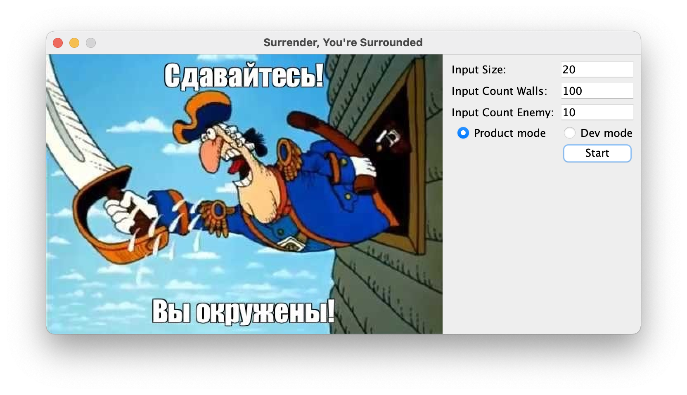

# Surrender, You're Surrounded Again
A game with 2D graphics and random generation of the field and enemies, the task is to get to the exit while running away from enemies.

## Overview

A simple turn-based game. All game elements are randomly generated. The size of the field, the number of walls and enemies are set by the user when starting the program. The user's task is to get to the exit by moving in four directions. Enemies move towards the user trying to catch him.

## Installation

    mkdir target

    javac -d target/ -sourcepath Game/src/main/java/ -cp Game/src/main/java/edu/school21/game/app/Program.java ChaseLogic/src/main/java/edu/school21/chase/logic/*.java

    cp -r Game/src/main/resources/*.* target

    jar cmf Game/manifest.txt game.jar -C target .

    rm -rf target

    java -jar game.jar

## Usage

To start playing, you need to follow the instructions above.

You can change the number of enemies, number of walls inside the map, map size.
The user moves using the arrows keys.

The game has 2 modes: 
- 'production' mode with graphics, 

- 'dev' mode with primitive elements.

You can customize the colors and appearance of the map by editing files:
- for dev mode

    Game\src\main\resources\application-dev.properties

- for production mode

    Game\src\main\resources\application-production.properties

Have a nice game!!!

## Remove

    rm game.jar